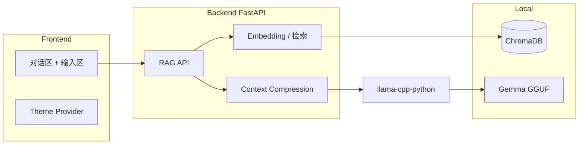

# 产品需求文档（PRD）：本地私人 RAG 问答助手

| 文档版本 | 日期 | 说明 |
|---------|------|------|
| v1.0 | 2026-04-07 | 初版，依据《需求.md》整理 |

---

## 1. 背景与目标

### 1.1 背景

用户希望在本地环境部署一套 **RAG（检索增强生成）** 系统：基于自建的语料库，提供面向个人的问答能力，数据与推理过程可控，不依赖公网大模型服务。

### 1.2 产品目标

- **核心目标**：在本地完成「语料入库 → 检索 → 生成回答」的闭环，形成可用的私人问答助手。
- **约束目标**：在 **NVIDIA RTX 4060（8GB 显存）** 等有限资源下稳定运行，避免因上下文过长导致显存溢出。

### 1.3 成功标准（可验收）

- 用户可上传或配置语料，系统能基于语料回答相关问题。
- 前端可与大模型进行多轮对话式交互；长文档场景下不因显存不足而崩溃（通过上下文压缩等机制缓解）。
- 界面符合既定视觉规范，并支持明暗主题切换。

---

## 2. 用户与场景

### 2.1 目标用户

- 希望在本地管理私有文档并提问的技术用户或个人知识工作者。

### 2.2 典型使用场景

1. 将 PDF、Markdown、纯文本等资料纳入语料库，针对资料内容提问。
2. 在对话区连续追问，依赖检索结果与本地模型生成答案。
3. 在弱网或离线（模型与数据均在本地）环境下使用。

---

## 3. 功能需求

### 3.1 语料与 RAG 能力

| ID | 需求描述 | 优先级 |
|----|----------|--------|
| F-01 | 支持用户维护「私人语料库」：文档可导入/索引（具体格式与导入方式可在实现阶段细化，但需与向量检索打通） | P0 |
| F-02 | 用户提问时，系统从语料中检索相关片段，作为上下文输入大模型生成回答 | P0 |
| F-03 | 对话区展示模型回复；需明确错误与空检索时的用户提示（实现层定义文案与状态） | P0 |

### 3.2 上下文压缩（Context Compression）

| ID | 需求描述 | 优先级 |
|----|----------|--------|
| F-04 | 提供 **上下文压缩模块**：在送入推理前对过长上下文进行处理，降低显存占用峰值，适配 8GB 显存 | P0 |
| F-05 | 压缩策略需在技术方案中定义（例如：摘要、截断优先级、分块合并策略等），并保证在可接受范围内不严重损害回答质量 | P1 |

### 3.3 前端交互与布局

| ID | 需求描述 | 优先级 |
|----|----------|--------|
| F-06 | **布局**：页面分为上下两部分——**上方**占除底部外全部高度，用于与大模型的对话交互；**下方**为**固定高度**区域，放置用户输入框 | P0 |
| F-07 | 输入框提交问题后，请求后端 RAG/对话接口并展示流式或非流式结果（与后端 API 设计对齐） | P0 |

### 3.4 主题与视觉

| ID | 需求描述 | 优先级 |
|----|----------|--------|
| F-08 | 默认视觉：**黑灰色系**，参考海外主流偏炫酷的站点风格 | P0 |
| F-09 | 通过 **Theme Provider** 集中配置主题色；支持 **暗色 / 亮色** 切换并持久化（建议 localStorage，实现层确认） | P0 |
| F-10 | 图标使用 **Font Awesome** | P0 |

---

## 4. 非功能需求

### 4.1 技术栈（约束）

| 层级 | 技术选型 |
|------|----------|
| 前端 | React、TypeScript、Tailwind CSS、Vite、Framer Motion、axios |
| 后端 | Python、FastAPI |
| 向量库 | ChromaDB |
| 模型 | Gemma-4-E4B-GGUF |
| 推理 | llama-cpp-python |

### 4.2 工程与仓库

| ID | 需求描述 | 优先级 |
|----|----------|--------|
| N-01 | 项目目录：`src/main` 主进程、`src/preload` 预加载、`src/renderer` React（Vite）；后端由外部 API 提供 | P0 |
| N-02 | 新增 `.gitignore`，包含前后端及本地模型、向量库、环境文件等常见忽略项 | P0 |

### 4.3 性能与可靠性

- 在 8GB 显存设备上，单次请求的上下文长度与批大小需与模型量化、上下文压缩策略联合调优。
- API 需有超时与错误返回结构，前端需展示友好错误信息。

### 4.4 安全与隐私（本地产品）

- 语料与索引默认仅存本地；若未来增加远程同步，需单独 PRD 说明。

---

## 5. 系统架构（逻辑）

---

## 6. 范围外（本版不包含，可列入后续）

- 多用户账号体系与权限管理。
- 云端部署与多端同步。
- 除需求已列模型外的模型热插拔管理界面（若需可另开迭代）。

---

## 7. 风险与依赖

| 风险 | 缓解思路 |
|------|----------|
| 长文档 + 大上下文导致 OOM | 上下文压缩、合理 chunk、限制 max tokens、量化模型选择 |
| Gemma GGUF 与 llama-cpp-python 版本兼容性 | 锁定依赖版本并在 README 记录环境 |
| Chroma 数据路径与备份 | 约定数据目录并在 .gitignore 中排除 |

---

## 8. 里程碑建议（供排期参考）

1. **M1**：Electron + `src/` 分层、`.gitignore`、主题 Provider 与基础布局。
2. **M2**：Chroma 入库与检索 API、与前端问答串联。
3. **M3**：接入 llama-cpp-python + Gemma GGUF，端到端 RAG。
4. **M4**：上下文压缩模块联调、8GB 显存压测与参数调优。

---

## 9. 附录：与原始需求对照

| 需求.md 条目 | PRD 章节 |
|--------------|----------|
| 技术栈与压缩模块 | §4.1、§3.2、§7 |
| 主题与 Font Awesome | §3.4 |
| .gitignore | §4.2 |
| 上下布局 | §3.3 |
| src/main · preload · renderer | §4.2 |

---

*本文档由《需求.md》衍生，后续变更请以版本表更新为准。*
